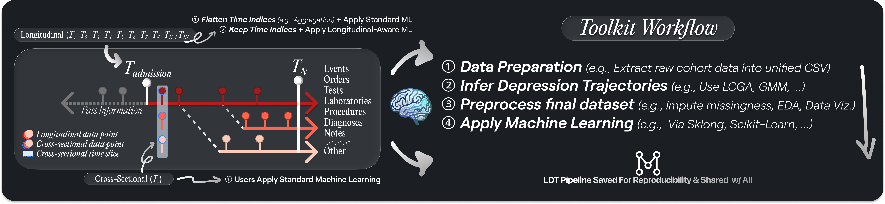

<!--suppress HtmlDeprecatedAttribute -->
<div align="center">
   <br>
   <picture>
      <source media="(prefers-color-scheme: light)" srcset="public/logo/readme_title_ldtt_light.svg">
      <source media="(prefers-color-scheme: dark)" srcset="public/logo/readme_title_ldtt.svg">
      
   </picture>
   
   <br>
   <a href="https://github.com">Documentation</a> — <a href="https://life-epi-psych.github.io">LEAP group</a>
</div>

---

<div align="center">


</div>

## <a id="about-the-project"></a>💡 About The Project

The `Longitudinal Depression Trajectories Toolkit (LDT-Toolkit)` is a command-line toolkit that enables researchers to move
from raw cohort data to trajectory-based datasets, then to machine-learning-ready data for downstream modeling.

`LDT-Toolkit` is designed as a general toolkit for longitudinal depression trajectory studies. This repository currently uses
the [Millennium Cohort Study (MCS) from the Centre for Longitudinal Studies (CLS), UCL](https://cls.ucl.ac.uk/cls-studies/millennium-cohort-study/)
as a proof-of-concept case study.

**Wait, what is _Longitudinal_ Data in layman's terms?**

_Longitudinal_ data is a "time-lapse" of the same subject measured repeatedly across time. Instead of one snapshot,
you observe evolution: how depressive symptoms change from _wave_ to _wave_, who follows _stable_ patterns, and who
_diverges_. That temporal signal is often more informative than a single cross-sectional snapshot when the objective
is prediction and trajectory discovery.

**`LDT-Toolkit`'s workflow, in a nutshell:**

1. (i) Prepare cohort data (e.g., convert source files) or generate synthetic _longitudinal_ data.
2. (ii) Build depressive symptom trajectories (e.g., via `LCGA`/`GMM`).
3. (iii) Preprocess datasets to become machine-learning-ready (e.g., combine, EDA, long-to-wide pivot).
4. (iv) Apply trajectory-based machine learning (longitudinal and standard estimators, currently placeholder).

### CLI Layout: `Playground` and `Presets — Reproducibility`

Each stage in `LDT-Toolkit` is split into two complementary interfaces:

- `Playground`: interactive commands for exploratory work and rapid iteration (e.g., try different preprocessing or modeling choices quickly).
- `Presets — Reproducibility`: a stage-level catalogue of predefined, study-oriented pipelines to reproduce paper-aligned workflows with fewer manual steps.

In practice, this means you can prototype in `Playground`, then switch to the stage presets catalogue when you need more reproducible, shareable runs.

[See more in the documentation.](https://github.com)

## <a id="installation"></a>🛠️ Installation

### Run directly from GitHub with `uv`

```bash
uvx --from git+https://github.com/OWNER/REPO.git ldt-toolkit --help
```

### Alternatively, clone and set up locally

```bash
git clone https://github.com/OWNER/REPO.git
cd REPO
uv python pin 3.10
uv sync
uv run ldt-toolkit --help
```

### Optional: Go + Charm interactive CLI

An optional Go interactive CLI is available in `cli`.

On Apple Silicon `macOS`, install Go with:

```bash
arch -arm64 brew install go
```

Then run (interactive entrypoint only):

```bash
cd cli
go run .
```

This opens the interactive Charm navigator (`Home`, `data_preparation`, `data_preprocessing`, `machine_learning`).

<details>
<summary><strong>R requirement for ``LCGA'' and ``GMM''</strong></summary>

For latent growth modeling approaches (`LCGA`, `GMM`) relying on R (`lcmm`), `Rscript` must be available.

Via `macOS` (Homebrew):

```bash
brew update
brew install r
Rscript --version
```

Via `Linux/Unix`:

```bash
sudo apt-get update && sudo apt-get install -y r-base
Rscript --version
```

Via `Windows`: install R from [CRAN](https://cran.r-project.org/) and ensure `Rscript.exe` is available on your `PATH`.

Then install required R dependencies for `LDT-Toolkit`:

```bash
Rscript --vanilla setup_R/install_requirements.R
```

</details>

## <a id="getting-started"></a>🚀 Getting Started

The following is one possible workflow to explore longitudinal depression trajectories with `LDT-Toolkit`, directly from your
terminal:

```bash
# Step 1) Generate synthetic longitudinal data (interactive)
uv run ldt-toolkit data_preparation synthetic_data_generation

# Step 2) Build trajectories (interactive)
uv run ldt-toolkit data_preprocessing build-trajectories

# Step 3) Pivot long-format data to wide-format data (interactive)
uv run ldt-toolkit data_preprocessing long_to_wide_pivot

# Step 4a) Longitudinal machine learning namespace (coming soon)
uv run ldt-toolkit machine_learning longitudinal-machine-learning

# Step 4b) Standard machine learning namespace (coming soon)
uv run ldt-toolkit machine_learning standard-machine-learning

# Step 4c) Standard ML benchmark suite
# (includes reproducibility notebook generation; profiler-at-end default = yes)
uv run ldt-toolkit machine_learning benchmark-standard-ml

# Step 4d) Generate benchmark pipeline profile notebook (inline PipelineProfiler)
uv run ldt-toolkit machine_learning pipeline-profile-benchmark
```

## <a id="citation"></a>📝 How to Cite

```bibtex
@software{Provost_Longitudinal_Depression_Trajectories_Toolkit,
    author = {Provost, Simon and Branco, Bianca and Kwong, Alex},
    title = {{Longitudinal Depression Trajectories Toolkit: Machine Learning for Longitudinal Studies}},
    version = {0.1.0}
}
```

Or use the **Cite this repository** option in the GitHub repository metadata.

## <a id="license"></a>🔐 License, Data & Security

* Access to [Millennium Cohort Study data is governed by CLS/UCL data access rules](https://cls.ucl.ac.uk/cls-studies/millennium-cohort-study/).
* Please review [SECURITY.md](./SECURITY.md) for handling expectations in this repository.
* This project is licensed under the [MIT License](./LICENSE).
