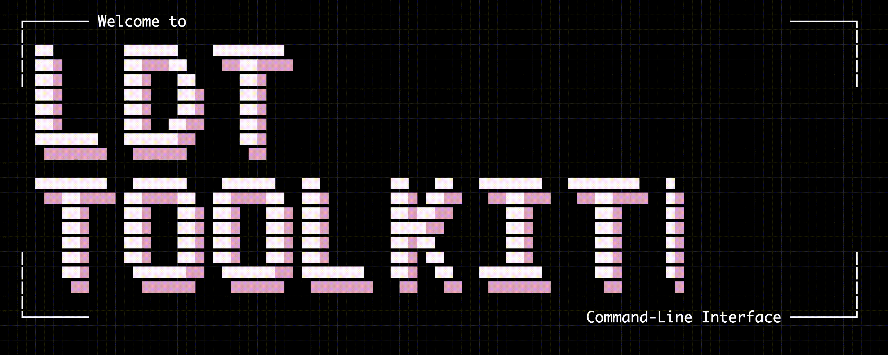

<div align="center">
  
</div>

<p align="center"><big><big><strong>L</strong>ongitudinal <strong>D</strong>epression <strong>T</strong>rajectories <em>Toolkit</em></big></big></p>

<div align="center">
  
  
  
  
  
  
</div>

<div align="center">
  <a href="https://github.com/OWNER/ldt-toolkit">Documentation (placeholder)</a> -
  <a href="https://life-epi-psych.github.io">LEAP Group</a>
</div>

##  About The Project

The `Longitudinal Depression Trajectories Toolkit (LDT-Toolkit)` initiative is designed for *social, medical, and clinical researchers* who work with repeated-measure data and require a *stepping-stone path* from raw cohort files to *downstream modelling*.

`LDT-Toolkit` is intended as a general toolkit for *longitudinal depression trajectory exploration*. It is currently using the [Millennium Cohort Study (MCS) from CLS/UCL](https://cls.ucl.ac.uk/cls-studies/millennium-cohort-study/) as a *proof-of-concept* case study.

The initiative delivers *two interconnected components*. First, `ldt-toolkit` (this repository) is the *Python engine* of tools and reproducible pipelines to accelerate exploration of longitudinal studies toward downstream modelling, while remaining fully usable in Python scripts or notebooks. Second, `ldt` is a *fully interactive* Go CLI with a *no-code* terminal interface for running and orchestrating the toolkit from start to finish.

The toolset supports *two broad lines of exploration*. `Playground` methods allow researchers to quickly iterate on their own datasets by running operations across *data preparation*, *data preprocessing*, and *machine learning* phases. With `Presets`, researchers can run *stage-level reproducible pipelines* for a given longitudinal study, and *community contributions* are encouraged so this can grow into a reusable collection of presets for preparing, preprocessing, and modelling longitudinal datasets.

And last, within the *data preprocessing* stage, we offer a *brand-new and novel* `Trajectories Builder Playground`: apply existing trajectory-building algorithms to your longitudinal datasets, or design and submit your own builders to help shape a community consensus around reproducible depression-trajectory construction.

##  Setup And Launch

> [!IMPORTANT]
> Use both components: `ldt-toolkit` (Python toolkit) and `ldt` (Go CLI). The CLI is the primary no-code interface and is highly recommended.

> [!WARNING]
> Windows is not supported by default yet.
> As a workaround, run the toolkit inside a Docker Linux environment, or use a macOS-based machine.
> Please open [an issue](https://github.com/Longitudinal-Depression-Toolkit/ldt-toolkit/issues?q=sort%3Aupdated-desc+is%3Aissue+is%3Aopen) if you want to contribute Windows support.

<details>
<summary><strong>Machine Requirements</strong> (<a href="https://www.r-project.org/">R</a>, <a href="https://www.python.org/downloads/">Python</a>, <a href="https://docs.astral.sh/uv/getting-started/installation/">uv</a>, <a href="https://go.dev/dl/">Go</a>)</summary>

Install the following first:
- Python `3.10` to `3.12`
- [`uv`](https://docs.astral.sh/uv/)
- Go (for `ldt` CLI)
- R + `Rscript` (required only when running `LCGA`/`GMM` tools through `lcmm`)

Quick checks:

```bash
python --version || python3 --version
uv --version
go version
Rscript --version
```

Example installs by OS:

```bash
# macOS (Homebrew)
brew update
brew install python@3.12 uv go r

# Linux (Ubuntu/Debian)
sudo apt-get update
sudo apt-get install -y python3 python3-pip golang r-base
curl -LsSf https://astral.sh/uv/install.sh | sh
```

</details>

### 1) Install `ldt-toolkit` (Python)

```bash
git clone https://github.com/OWNER/ldt-toolkit.git
cd ldt-toolkit
uv python pin 3.10
uv sync
```

Validate the install:

```bash
uv run python -c "import ldt; print(ldt.__file__)"
```

If you plan to run `LCGA`/`GMM`, install R-side dependencies:

```bash
Rscript --vanilla setup_R/install_requirements.R
```

### 2) Install `ldt` (Go CLI, essential no-code interface)

```bash
git clone https://github.com/OWNER/ldt.git
cd ldt
make build
```

Install it for your shell:

```bash
# bash/zsh users
make install-bash

# fish users
make install-fish
```

If your CLI repo uses short aliases, `make bash` / `make fish` are equivalent.

Reload your shell config, then run:

```bash
ldt
```

> [!TIP]
> The `ldt` CLI is the fastest way to explore the toolkit with no code. Use Python directly when you want low-level control.

###  Getting Started W/ the Toolset

<details>
<summary><strong>(1) Generate Synthetic Data (Multi-Technique)</strong></summary>

```python
from pathlib import Path

from ldt.data_preparation import EventShockRecovery, MissingDataScenarios, TrendPatterns

out = Path("/path/to/your/project/data")
out.mkdir(parents=True, exist_ok=True)

TrendPatterns(n_samples=400, n_waves=5, random_state=7).prepare().to_csv(
    out / "synthetic_trend_patterns.csv", index=False
)

EventShockRecovery().prepare(
    n_samples=400,
    n_waves=5,
    random_state=7,
    feature_cols=["depressive_score"],
    shock_wave=3,
    shock_mean=3.5,
    recovery_rate=0.9,
    noise_sd=0.8,
).to_csv(out / "synthetic_event_shock.csv", index=False)

MissingDataScenarios().prepare(
    n_samples=400,
    n_waves=5,
    random_state=7,
    feature_cols=["depressive_score", "sleep_score"],
    mechanism="mixed",
    missing_rate=0.20,
    dropout_rate=0.10,
    mar_strength=1.0,
).to_csv(out / "synthetic_with_missing.csv", index=False)
```

</details>

<details>
<summary><strong>(2) Build Trajectories (Two Techniques) + ShowTable</strong></summary>

```python
from pathlib import Path

from ldt.data_preprocessing import BuildTrajectories, ShowTable

input_long = Path("/path/to/your/project/data/synthetic_trend_patterns.csv")
out = Path("/path/to/your/project/outputs")
out.mkdir(parents=True, exist_ok=True)

BuildTrajectories().fit_preprocess(
    mode="from_scratch",
    input_path=input_long,
    output_path=out / "trajectories_dtw_kmeans.csv",
    id_col="subject_id",
    time_col="wave",
    value_cols=["depressive_score"],
    builder="dtw_kmeans",
    n_trajectories=4,
)
BuildTrajectories().fit_preprocess(
    mode="from_scratch",
    input_path=input_long,
    output_path=out / "trajectories_clusterMLD.csv",
    id_col="subject_id",
    time_col="wave",
    value_cols=["depressive_score"],
    builder="clusterMLD",
    n_trajectories=4,
)

ShowTable().fit_preprocess(
    input_path=out / "trajectories_clusterMLD.csv",
    output_html=out / "trajectories_clusterMLD_report.html",
    open_browser=False,
)
```

</details>

<details>
<summary><strong>(3) End-to-End: Synthetic Data to Standard ML</strong></summary>

```python
from pathlib import Path

from ldt.data_preparation import MissingDataScenarios
from ldt.data_preprocessing import (
    AggregateLongToCrossSectional,
    BuildTrajectories,
    CleanDataset,
    CombineDatasetWithTrajectories,
    MissingImputation,
)
from ldt.machine_learning import StandardMachineLearning

root = Path("/path/to/your/project")
raw_long = root / "data/synthetic_long_with_missing.csv"
clean_long = root / "outputs/long_clean.csv"
imputed_long = root / "outputs/long_imputed.csv"
trajectories = root / "outputs/trajectories.csv"
cross_sectional = root / "outputs/cross_sectional.csv"
model_ready = root / "outputs/model_ready.csv"

long_df = MissingDataScenarios().prepare(
    n_samples=1200,
    n_waves=6,
    random_state=42,
    feature_cols=["depressive_score", "sleep_score", "anxiety_score"],
    mechanism="mixed",
    missing_rate=0.20,
    dropout_rate=0.15,
    mar_strength=1.10,
)
raw_long.parent.mkdir(parents=True, exist_ok=True)
long_df.to_csv(raw_long, index=False)

CleanDataset().fit_preprocess(input_path=raw_long, output_path=clean_long)
MissingImputation().fit_preprocess(
    technique="mice_imputation",
    input_path=clean_long,
    output_path=imputed_long,
    random_state=42,
)
BuildTrajectories().fit_preprocess(
    mode="from_scratch",
    input_path=imputed_long,
    output_path=trajectories,
    id_col="subject_id",
    time_col="wave",
    value_cols=["depressive_score"],
    builder="clusterMLD",
    n_trajectories=4,
)
AggregateLongToCrossSectional().fit_preprocess(
    input_path=imputed_long,
    output_path=cross_sectional,
    subject_id_col="subject_id",
    numeric_columns=["depressive_score", "sleep_score", "anxiety_score", "age_baseline"],
    numeric_agg="mean",
)
CombineDatasetWithTrajectories().fit_preprocess(
    input_original_data_path=cross_sectional,
    input_trajectories_data_path=trajectories,
    output_path=model_ready,
    original_id_col="subject_id",
    trajectory_id_col="subject_id",
    merge_type="left",
    trajectory_columns=["trajectory_id", "trajectory_name"],
)

ml_result = StandardMachineLearning().fit_predict(
    technique="run_experiment",
    input_path=model_ready,
    target_column="trajectory_id",
    feature_columns="depressive_score,sleep_score,anxiety_score,age_baseline",
    estimator_key="random_forest",
    metric_keys="accuracy,f1_macro",
    cv_folds=5,
    validation_split="none",
    multiclass_mode="multiclass",
    random_seed=42,
    output_dir=str(root / "outputs/standard_ml"),
)
print(ml_result["mean_score"], ml_result["report_path"])
```

</details>

*But there is more: explore the full [documentation](https://github.com/OWNER/ldt-toolkit) for the complete tool and presets catalogue.*

##  Citation

```bibtex
@software{Provost_Longitudinal_Depression_Trajectories_Toolkit,
    author = {Provost, Simon and Branco, Bianca and Kwong, Alex},
    title = {{Longitudinal Depression Trajectories Toolkit: Machine Learning for Longitudinal Studies}},
    version = {0.0.1}
}
```

Use GitHub's "Cite this repository" for citation metadata updates.

##  License, Data, Security

- Access to [Millennium Cohort Study data is governed by CLS/UCL data access rules](https://cls.ucl.ac.uk/cls-studies/millennium-cohort-study/).
- Review [SECURITY.md](./SECURITY.md) for handling expectations.
- Licensed under the [MIT License](./LICENSE).
